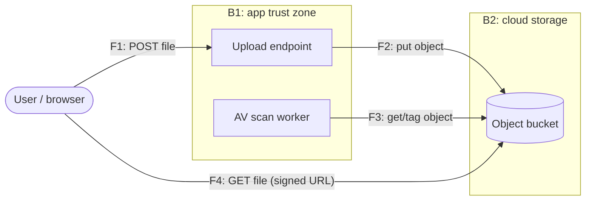

# Threat model: profile attachment upload (worked example)

A filled-in pass of [template.md](template.md) for a small feature —
"users can attach a file to their profile" — sized at ~30 minutes.
Everything below is illustrative; the point is the shape: every threat
names an asset and a boundary, states precondition and impact, and ends
mitigated or explicitly accepted.

| | |
|---|---|
| **Feature** | Profile attachment upload (design: PR #142) |
| **Date** | 2026-09-26 |
| **Owner** | @app-team/backend |
| **Status** | active |

Trigger check: new external boundary (users send us bytes), new data
class (user-generated files), new third-party-ish flow (cloud object
storage) → a model is warranted.

## Assets

- Uploaded files (user content — treat as PII until proven otherwise)
- The object storage bucket and its write credentials
- Availability of the app (upload endpoint shares the web tier)
- Integrity of every *other* user's profile (a served file executes in
  their browser's context if we get content handling wrong)

## Trust boundaries

- **B1:** internet → application (unauthenticated network →
  authenticated app process)
- **B2:** application → object storage (app process → cloud service,
  crossed with the app's storage credentials)

## Data flow diagram

## STRIDE table

| ID | Element/Flow | STRIDE | Threat | Asset | Precondition | Impact | Risk | Mitigation (type) | Owner | Status |
|----|--------------|--------|--------|-------|--------------|--------|------|-------------------|-------|--------|
| T1 | F1 (B1) | S | Attacker uploads to another user's profile by forging the profile id in the request | Other users' profiles | Any authenticated account | Defacement, phishing lure hosted under victim's identity | H | Authorize profile ownership server-side, ignore client-sent ids (prevent) — `api/uploads/handler.go` | @backend | mitigated |
| T2 | F1 (B1) | T | Malware or polyglot file uploaded; content-type header spoofed as `image/png` | Uploaded files; every downloader's machine | Any authenticated account | Malware distribution through our domain | H | Sniff real type server-side, allowlist extensions, AV scan before serving (prevent+detect) — `workers/scan.go` | @backend | mitigated |
| T3 | F1 (B1) | R | User disputes having uploaded abusive content; no trail of who uploaded what | Audit trail | Absence of logging | Cannot act on abuse reports or legal requests | M | Log user id, object key, hash, timestamp to audit log (detect) — `api/uploads/audit.go` | @backend | mitigated |
| T4 | F4 (B2) | I | Bucket or object ACL public; enumeration of object keys leaks all users' files | Uploaded files (PII) | Misconfigured bucket policy | Mass disclosure of user content | H | Private bucket, per-object access via short-lived signed URLs, unguessable keys (prevent); config scanner on bucket policy (detect) — `infra/storage.tf` | @platform | mitigated |
| T5 | F1 (B1) | D | Oversized or unbounded-count uploads exhaust disk/memory/storage quota | Availability of app | None (any account, or pre-auth if endpoint misconfigured) | Upload tier degraded for all users | M | Max body size at LB and app, per-user rate + quota (prevent) — `infra/lb.tf`, `api/middleware/limits.go` | @platform | mitigated |
| T6 | F4 (B1→B2) | E | Uploaded HTML/SVG served from app origin executes as XSS; path traversal in user-named keys writes outside the prefix | Session tokens; bucket contents | File served with attacker-controlled type/name | Account takeover; overwrite of arbitrary objects | H | Serve from sandboxed domain with `Content-Disposition: attachment`; server-generated object keys, never user filenames (prevent) — `api/uploads/keys.go` | @backend | mitigated |
| T7 | F3 (B1) | D | AV scan queue backlog delays file availability | Availability of uploads | Scan worker outage | Files stuck in "pending" state | L | Accepted — see below | @backend | accepted |

## Accepted risks

| ID | Risk | Reason accepted | Owner | Expiry / revisit |
|----|------|-----------------|-------|------------------|
| T7 | Scan backlog delays availability | Degrades UX, not safety — files are never served unscanned; queue depth is alerted | @backend | 2027-03-31, or when uploads exceed 10k/day |
