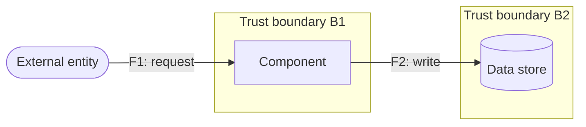

# Threat model: <feature>

| | |
|---|---|
| **Feature** | <name / link to design doc or PR> |
| **Date** | <YYYY-MM-DD> |
| **Owner** | <person accountable for keeping this model current> |
| **Status** | draft / active / superseded (link) / retired |

Store this file at `docs/threat-models/<feature>.md`. Revisit it on every
architecture change to the feature; a stale model gives false confidence.

## Assets

What is worth attacking. Data, credentials, availability. A threat that
doesn't put one of these at risk is a non-threat.

- <e.g. user PII in the profile store>
- <e.g. service credentials for the payment provider>
- <e.g. availability of the checkout flow>

## Trust boundaries

Where the level of trust changes: network (internet → VPC), process
(app → database), privilege (user → admin), org (us → third party).

- **B1:** <e.g. internet → application (unauthenticated → authenticated)>
- **B2:** <e.g. application → object storage (app process → cloud service)>

## Data flow diagram

Components, data stores, external entities; every flow that crosses a
boundary is a row in the STRIDE table below. (A whiteboard photo + a
bullet list is an acceptable substitute — capture it, don't skip it.)

## STRIDE table

One pass per element and per boundary-crossing flow: Spoofing,
Tampering, Repudiation, Information disclosure, Denial of service,
Elevation of privilege. State the precondition and the impact — never
just "an attacker could X". Risk is High/Med/Low (use likelihood ×
impact when H/M/L stops discriminating). Mitigation is one of
prevent / detect / respond / accept.

| ID | Element/Flow | STRIDE | Threat | Asset | Precondition | Impact | Risk | Mitigation (type) | Owner | Status |
|----|--------------|--------|--------|-------|--------------|--------|------|-------------------|-------|--------|
| T1 | F1 (B1) | S | <threat> | <asset> | <what the attacker needs> | <what is lost> | H/M/L | <control + link to code/config> (prevent) | <who> | open |
| T2 | | T | | | | | | | | |
| T3 | | R | | | | | | | | |
| T4 | | I | | | | | | | | |
| T5 | | D | | | | | | | | |
| T6 | | E | | | | | | | | |

## Accepted risks

Every accepted threat from the table above, with a reason, an owner,
and an expiry. An accepted risk with no owner and no expiry is just an
untracked risk.

| ID | Risk | Reason accepted | Owner | Expiry / revisit |
|----|------|-----------------|-------|------------------|
| T_ | <threat> | <why acceptance is defensible> | <who> | <YYYY-MM-DD or trigger> |
